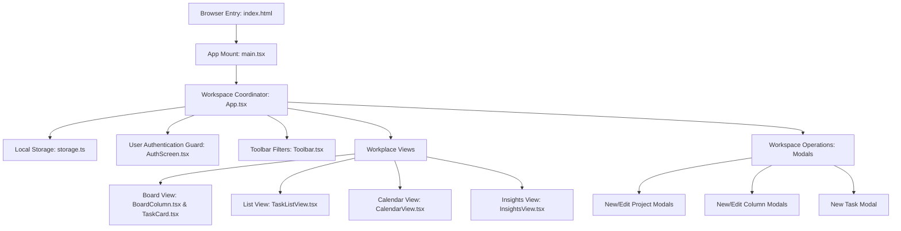

# Architecture Walkthrough (ARCHITECTURE.md)

This document describes the high-level architecture, state flow, and component design of TaskFlow.

---

## 🗺️ Architectural Overview

TaskFlow is a self-contained, client-side React SPA. It does not have a backend API or server database. The state is synchronized synchronously to `localStorage` on every change.

---

## 💾 State Management & Data Pipeline

The state is orchestrated in `App.tsx` using the following core hooks:
1. `projects`: List of `Project` objects. Each project contains an array of `Column` structures (phases).
2. `tasks`: List of `Task` objects. Each task contains attributes like `projectId`, `status` (referencing a column's `id`), `assignees`, `priority`, and `dueDate`.
3. `user`: The currently logged-in user profile (`email`, `name`, `avatar`, `color`).
4. `theme`: Represents the active layout color style (`"light" | "dark"`).

### Local Storage Serialization
- **Mount Phase**: App executes `loadBoardState()` in `src/utils/storage.ts` to restore projects, tasks, user sessions, and themes from `localStorage` under the key `modern-kanban-board-v2`. If empty, it initializes the app with sample data from `src/data/sampleTasks.ts`.
- **Sync Phase**: On any change in `projects`, `tasks`, `theme`, or `user`, a `useEffect` triggers `saveBoardState()`, serializing state back into `localStorage`.

---

## 🔀 Drag-and-Drop Implementation

Drag-and-drop operations are implemented in `App.tsx` using `@dnd-kit/core`:
- **Sensors**: Instantiates `PointerSensor` (with a `6px` move threshold to prevent accidental clicks), `TouchSensor` (with a `120ms` delay to allow natural scrolling on mobile), and `KeyboardSensor`.
- **Reordering**: Uses `arrayMove` to shift elements.
- **Project Reassignment (Global Board)**: Dragging cards between project columns updates the task's `projectId` and resets its status to the new project's first column.
- **Workflow Reassignment (Project Board)**: Dragging cards updates the task's `status` (referencing custom columns).

---

## 🔑 Authentication Flow

Access to TaskFlow is managed via an authentication guard in `App.tsx`:
1. Check if `user` state exists on startup. If not, mount `<AuthScreen />`.
2. `<AuthScreen />` handles signup and sign-in modes. Registered credentials are stored in `taskflow-registered-users`.
3. Passwords are protected using a native SHA-256 Web Crypto hash.
4. On success, `onLogin` triggers `setUser(user)` which updates state, re-renders `App.tsx`, and loads the dashboard.
