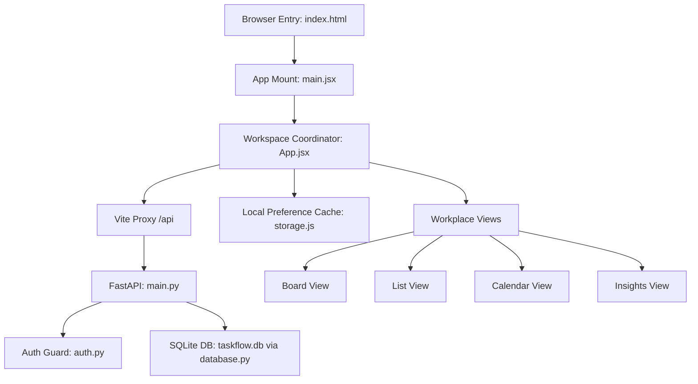

# Architecture Walkthrough

This document describes the high-level architecture, state flow, and component design of TaskFlow.

---

## 🗺️ Architectural Overview

TaskFlow is structured as a full-stack web application consisting of a **FastAPI (Python)** backend serving a SQLite database, and a **React (JavaScript)** single-page application frontend.

---

## 💾 Data Flow & State Management

The core state of the application is maintained in `App.jsx`:
1.  **Mount phase**: The frontend checks for an active JWT token in `localStorage`. If found, it requests the current user profile `/api/auth/me` and the active workspace state `/api/board` containing all projects, columns, and tasks.
2.  **User Actions**:
    *   Creating/updating/deleting tasks, projects, or columns triggers an API request to the backend.
    *   State is updated optimistically on the client to ensure zero lag, while asynchronous backend synchronization keeps the SQLite database up to date.
3.  **Local storage cache**: Local storage is only used to store the user authentication token and local preferences like the UI theme (`light` or `dark`).

---

## 🗃️ Backend Runtimes

*   **FastAPI**: Exposes CORS-friendly REST endpoints for auth, projects, columns, and tasks.
*   **SQLAlchemy ORM**: Connects to a local SQLite database file (`taskflow.db`) and defines relational tables for:
    *   `User`: Registered credentials and color profiles.
    *   `Project`: Scope containers representing independent workspaces.
    *   `ProjectColumn`: Ordered phase tracks belonging to projects.
    *   `Task`: Individual task cards belonging to projects and columns, containing JSON arrays for assignees and labels.

---

## 🔑 Authentication Flow

Access to the board views is guarded by user session status:
1.  If no JWT token is stored, the app mounts the `<AuthScreen />`.
2.  `<AuthScreen />` submits credentials (email and password hashed with SHA-256 client-side) to `/api/auth/login`.
3.  On success, the backend returns a JWT token, which the frontend stores in `localStorage` as `taskflow-token` and injects into the `Authorization: Bearer <token>` header of all subsequent API requests.
4.  Default projects and tasks are seeded automatically for newly registered users on the server side.
